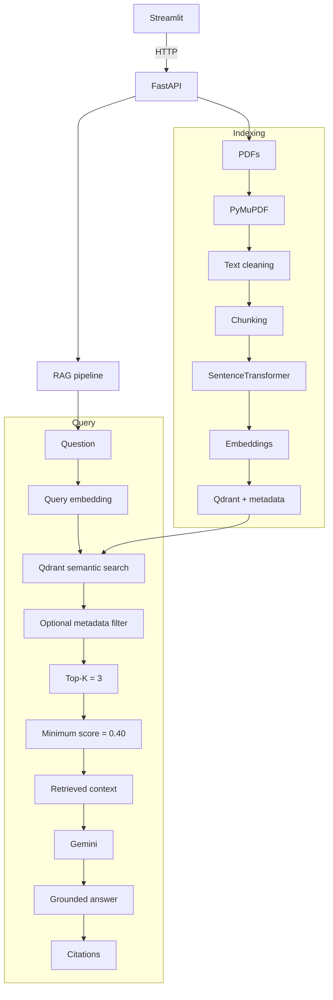
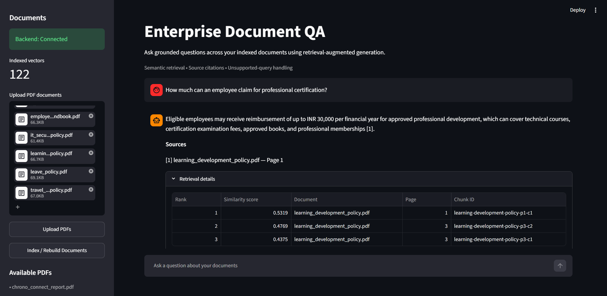
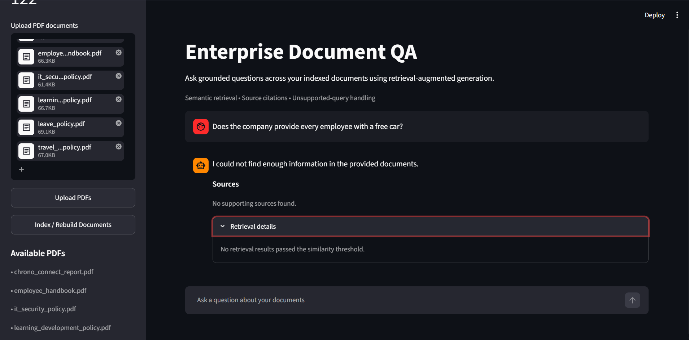
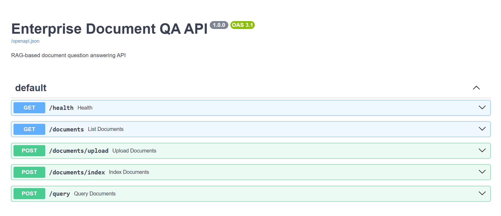
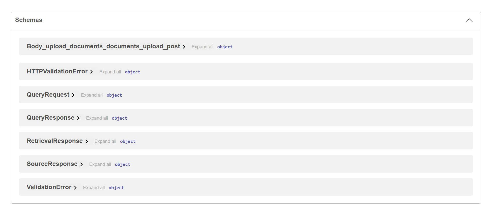

# Enterprise Document QA — RAG-Based Assistant

## Overview

Enterprise Document QA is a retrieval-augmented generation (RAG) system that indexes multiple enterprise PDFs, retrieves semantically relevant chunks, and supplies that evidence to Gemini for grounded answers with page-level citations. It rejects unsupported questions when retrieval does not find sufficient evidence.

## Key Features

- Multi-PDF ingestion with page-aware PyMuPDF extraction and cleaning
- Sentence-aware, token-budgeted chunking with controlled overlap
- SentenceTransformer document and query embeddings
- Persistent Qdrant vector search using cosine similarity
- Top-K retrieval with similarity-threshold rejection
- Optional document and category metadata filtering
- Gemini generation grounded only in retrieved context
- Validated inline citations linked to document and page metadata
- Retrieval evaluation plus FastAPI and Streamlit application layers

## Architecture



## How RAG Works

### Indexing

PyMuPDF extracts readable text page by page, after which conservative cleaning removes extraction noise. Text is split into page-local chunks of up to 220 tokens with 40 tokens of overlap. `sentence-transformers/all-MiniLM-L6-v2` produces normalized 384-dimensional embeddings, which are stored in Qdrant with document, page, and chunk metadata.

### Querying

Each question is embedded with the same MiniLM model and searched against Qdrant using cosine similarity and optional metadata filters. The system retrieves up to three chunks and rejects results below 0.40. Surviving context is sent to Gemini, and the returned answer is validated before its cited document pages are displayed.

## Tech Stack

| Area | Technology |
|---|---|
| Language | Python |
| Backend | FastAPI |
| Interface | Streamlit |
| PDF extraction | PyMuPDF |
| Embeddings | SentenceTransformers with `sentence-transformers/all-MiniLM-L6-v2` |
| Vector database | Qdrant |
| Generation | Gemini API / `google-genai` |

## Project Structure

```text
enterprise-document-qa/
├── app/{ingestion,retrieval,generation,evaluation}/
├── data/{documents,evaluation}/
├── docs/screenshots/
├── scripts/
├── api.py
├── app.py
├── requirements.txt
├── .env.example
└── README.md
```

Generated Qdrant data, `.venv`, caches, secrets, and local documents are excluded from Git.

## Quick Start

### 1. Create environment

```powershell
python -m venv .venv
.venv\Scripts\activate
pip install -r requirements.txt
```

### 2. Configure Gemini

Create `.env` in the project root and never commit it:

```dotenv
GEMINI_API_KEY=your_api_key_here
```

### 3. Index documents

Place PDFs in `data/documents/`. Uploading only saves a PDF; running indexing makes it searchable:

```powershell
python scripts/index_documents.py --reset
```

### 4. Start backend

```powershell
uvicorn api:app --reload --port 8000
```

### 5. Start UI

```powershell
streamlit run app.py
```

Streamlit: [http://localhost:8501](http://localhost:8501) · Swagger: [http://127.0.0.1:8000/docs](http://127.0.0.1:8000/docs)

## Retrieval Configuration

| Setting | Value |
|---|---:|
| Chunk size | 220 tokens |
| Chunk overlap | 40 tokens |
| Top-K | 3 |
| Minimum similarity score | 0.40 |

Top-K and minimum similarity score were selected from retrieval evaluation experiments on the project's controlled dataset. Chunk size and overlap were implementation choices and are not claimed to be experimentally optimal.

## Retrieval Evaluation

Retrieval was evaluated on a controlled 20-question supported-query dataset, with additional unsupported questions used for threshold testing.

| K | Hit Rate | Precision | Recall | MRR |
|---:|---:|---:|---:|---:|
| 1 | 1.0000 | 1.0000 | 0.9000 | 1.0000 |
| **3** | **1.0000** | **0.8167** | **1.0000** | **1.0000** |
| 5 | 1.0000 | 0.7900 | 1.0000 | 1.0000 |
| 8 | 1.0000 | 0.7438 | 1.0000 | 1.0000 |

`K=3` was selected because it achieved full measured recall while retaining higher precision than larger K values.

| Minimum score | Supported success | Unsupported rejection |
|---:|---:|---:|
| 0.40 | 1.0000 | 1.0000 |
| 0.50 | 0.9000 | 1.0000 |
| 0.60 | 0.6000 | 1.0000 |

Metrics: Hit Rate@K checks whether relevant evidence was retrieved, Precision@K measures relevance among retrieved chunks, Recall@K measures coverage of expected sources, and MRR rewards relevant results appearing earlier.

These results apply only to the project's controlled evaluation corpus and are not universal performance claims.

## Hallucination Control & Citations

Chunks below the minimum similarity score are rejected; if no chunks survive, Gemini is not called. When evidence is available, Gemini is instructed to use only the retrieved context.

Each chunk retains document and page metadata. Citation numbers are validated, and only valid sources actually referenced in the answer are displayed. These controls reduce unsupported generation but do not guarantee hallucination-free output.

## Example Queries

- “How much can an employee claim for professional certification?”
- “If I don't use all my vacation days this year, can I save them for later?”
- “What technologies were used for the user-facing part of Chrono Connect?”
- “Does the company provide every employee with a free car?”

The final query demonstrates unsupported-query rejection.

## Screenshots

### Main interface



### Unsupported-query handling



### FastAPI Swagger documentation





## API Endpoints

| Method | Endpoint | Purpose |
|---|---|---|
| GET | `/health` | Backend/index status |
| GET | `/documents` | List available PDFs |
| POST | `/documents/upload` | Upload PDFs |
| POST | `/documents/index` | Rebuild document index |
| POST | `/query` | Run a grounded RAG query |

## Limitations

- Text-based PDFs only; no OCR
- Retrieval depends on embedding and source-document quality
- Similarity threshold is corpus-dependent
- No reranking or hybrid BM25/vector search
- No persistent conversational memory
- Gemini availability and latency affect answer generation

## Future Improvements

- Hybrid BM25 and vector retrieval
- Cross-encoder reranking
- OCR support
- Hosted/scalable vector database and access controls

## Security

- Never commit `.env` or API keys.
- Enterprise documents may contain sensitive information.
- Production systems require authentication, authorization, and appropriate data governance.

## Author

**Akula S V P Sai Ram** · B.Tech Computer Science and Engineering · Mahatma Gandhi Institute of Technology (MGIT)
