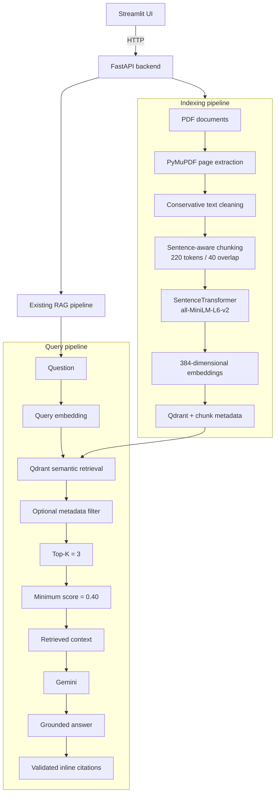

# Enterprise Document QA — RAG-Based Assistant

## Overview

Enterprise Document QA is a retrieval-augmented generation (RAG) assistant for asking grounded questions across a collection of enterprise PDF documents. It extracts and indexes document text, retrieves the most relevant passages for each question, and uses Gemini to synthesize a concise answer with inline document and page citations.

RAG keeps answer generation tied to retrieved source material instead of relying only on a language model's general knowledge. The application also rejects unsupported questions when no retrieved chunks meet the configured similarity threshold.

## Key Features

- Multi-PDF upload, ingestion, and repeatable index rebuilding
- Page-level text extraction with PyMuPDF
- Conservative text cleaning and sentence-aware, token-budgeted chunking
- Normalized SentenceTransformer document and query embeddings
- Persistent local Qdrant storage with cosine-similarity retrieval
- Optional document and category metadata filters
- Evaluation-selected retrieval defaults: Top-K 3 and minimum score 0.40
- Gemini-based answers grounded in retrieved context
- Unsupported-query rejection without calling Gemini
- Validated inline citations linked to document and page metadata
- Retrieval evaluation with Hit Rate@K, Precision@K, Recall@K, and MRR
- FastAPI backend and Streamlit user interface
- Compact retrieval-debug details and browser-session chat history

## Architecture



## RAG Pipeline

### Indexing

The indexing pipeline discovers PDFs under `data/documents/`, extracts readable text page by page, applies conservative cleaning, and creates page-local chunks within a 220-token budget with 40 tokens of overlap. `sentence-transformers/all-MiniLM-L6-v2` converts the chunks into normalized 384-dimensional embeddings, which are stored in the local Qdrant collection with document, page, chunk, token-count, and optional category metadata.

### Querying

Each question is embedded with the same SentenceTransformer model and searched against Qdrant using cosine similarity. Optional metadata filters are applied during retrieval. By default, the system requests the top three chunks and retains only results scoring at least 0.40. Accepted chunks are placed into the grounded prompt, Gemini generates the answer, and citation markers are validated against the supplied contexts before source metadata is displayed.

## Technology Stack

| Component | Technology |
|---|---|
| Language | Python |
| API | FastAPI, Uvicorn |
| Interface | Streamlit |
| PDF extraction | PyMuPDF |
| Embeddings | SentenceTransformers |
| Embedding model | `sentence-transformers/all-MiniLM-L6-v2` |
| Vector database | Qdrant |
| Generation | Gemini API |
| Gemini SDK | `google-genai` |

## Project Structure

```text
enterprise-document-qa/
├── app/
│   ├── __init__.py
│   ├── config.py
│   ├── evaluation/
│   │   ├── __init__.py
│   │   ├── evaluator.py
│   │   ├── metrics.py
│   │   └── models.py
│   ├── generation/
│   │   ├── __init__.py
│   │   ├── citation_builder.py
│   │   ├── llm_service.py
│   │   ├── models.py
│   │   ├── prompt_builder.py
│   │   └── rag_service.py
│   ├── ingestion/
│   │   ├── __init__.py
│   │   ├── chunker.py
│   │   ├── indexing_service.py
│   │   ├── models.py
│   │   ├── pdf_loader.py
│   │   └── text_cleaner.py
│   ├── retrieval/
│   │   ├── __init__.py
│   │   ├── embedding_service.py
│   │   ├── models.py
│   │   ├── retriever.py
│   │   └── vector_store.py
│   └── utils/
│       └── __init__.py
├── data/
│   ├── documents/
│   │   └── .gitkeep
│   └── evaluation/
│       ├── results/
│       │   ├── retrieval_k5.csv
│       │   ├── retrieval_k5_summary.json
│       │   ├── threshold_comparison.csv
│       │   └── top_k_comparison.csv
│       └── retrieval_questions.json
├── docs/
│   └── screenshots/
│       └── .gitkeep
├── scripts/
│   ├── ask_documents.py
│   ├── evaluate_retrieval.py
│   ├── experiment_threshold.py
│   ├── experiment_top_k.py
│   ├── index_documents.py
│   ├── inspect_ingestion.py
│   ├── search_documents.py
│   └── test_gemini.py
├── tests/
│   └── __init__.py
├── vector_store/
│   └── .gitkeep
├── .env.example
├── .gitignore
├── api.py
├── app.py
├── README.md
└── requirements.txt
```

Local PDFs, Qdrant database files, virtual environments, and cache directories are intentionally excluded from this tree because they are not committed.

## Installation

Create and activate a virtual environment from the project root:

```powershell
python -m venv .venv
.venv\Scripts\activate
```

Install the dependencies:

```powershell
pip install -r requirements.txt
```

Copy `.env.example` to `.env` and replace the placeholder with your Gemini API key:

```dotenv
GEMINI_API_KEY=your_api_key_here
```

Never commit `.env` or an actual API key.

## Document Indexing

Place source PDFs in `data/documents/`, then rebuild the local vector collection:

```powershell
python scripts/index_documents.py --reset
```

Uploading through Streamlit or `POST /documents/upload` only saves PDFs into `data/documents/`; it does not update the vector index automatically. Use **Index / Rebuild Documents**, call `POST /documents/index`, or run the indexing command after uploading. The `--reset` option recreates the collection before indexing, which prevents stale vectors from removed documents.

## Running the Application

Start the FastAPI backend in the first terminal:

```powershell
uvicorn api:app --reload --port 8000
```

Start Streamlit in a second terminal:

```powershell
streamlit run app.py
```

- Streamlit: [http://localhost:8501](http://localhost:8501)
- FastAPI Swagger UI: [http://127.0.0.1:8000/docs](http://127.0.0.1:8000/docs)

## CLI Usage

Index or rebuild all source documents:

```powershell
python scripts/index_documents.py --reset
```

Inspect accepted semantic retrieval results without calling Gemini:

```powershell
python scripts/search_documents.py "How many annual leave days are available?"
```

Ask a grounded question through the complete RAG pipeline:

```powershell
python scripts/ask_documents.py "What is the reimbursement limit for training?"
```

Use `--help` with a CLI script to see its optional Top-K, minimum-score, category, and document filters.

## Retrieval Configuration

| Setting | Value | Purpose |
|---|---:|---|
| Chunk size | 220 tokens | Limits each indexed context to a compact token budget |
| Chunk overlap | 40 tokens | Preserves limited continuity between adjacent chunks |
| Default Top-K | 3 | Retrieves up to three candidate chunks |
| Minimum similarity score | 0.40 | Rejects weak semantic matches |

Top-K and the minimum score were selected from the Day-6 retrieval experiments on this project's controlled evaluation dataset. The chunk size and overlap are implementation choices and are not claimed to be experimentally optimal.

## Retrieval Evaluation

The repository includes a controlled, document-level evaluation dataset and scripts for evaluating raw retrieval rankings and supported/unsupported threshold decisions:

```powershell
python scripts/evaluate_retrieval.py --top-k 5
python scripts/experiment_top_k.py
python scripts/experiment_threshold.py
```

### Top-K experiment

| K | Hit Rate | Precision | Recall | MRR |
|---:|---:|---:|---:|---:|
| 1 | 1.0000 | 1.0000 | 0.9000 | 1.0000 |
| 3 | 1.0000 | 0.8167 | 1.0000 | 1.0000 |
| 5 | 1.0000 | 0.7900 | 1.0000 | 1.0000 |
| 8 | 1.0000 | 0.7438 | 1.0000 | 1.0000 |

### Similarity-threshold experiment

| Minimum score | Supported success | Unsupported rejection |
|---:|---:|---:|
| 0.40 | 1.0000 | 1.0000 |
| 0.50 | 0.9000 | 1.0000 |
| 0.60 | 0.6000 | 1.0000 |

- **Hit Rate@K:** the fraction of supported questions for which at least one expected document appears in the first K results.
- **Precision@K:** the fraction of the K retrieval positions occupied by chunks from expected documents.
- **Recall@K:** the fraction of unique expected documents represented in the first K results.
- **MRR:** the mean reciprocal rank of the first relevant result, rewarding relevant evidence that appears earlier.

These measurements apply only to the project's fixed corpus and controlled evaluation questions. They are evidence for configuration decisions, not universal accuracy, quality, or production-performance claims.

## Example Queries

- “How much can an employee claim for professional certification?”
- “If I don't use all my vacation days this year, can I save them for later?”
- “What technologies were used for the user-facing part of Chrono Connect?”
- “Does the company provide every employee with a free car?”

The final example is intentionally unsupported and should demonstrate threshold-based rejection.

## Hallucination Control

The application uses two complementary safeguards:

1. **Retrieval score threshold:** chunks below the configured similarity score are rejected. If no chunks remain, the application returns the insufficient-context response without calling Gemini.
2. **Prompt-level grounding:** when evidence is available, the prompt instructs Gemini to answer only from the supplied contexts and to cite them inline.

These controls reduce unsupported generation but do not eliminate hallucinations. Results should still be reviewed before use in consequential workflows.

## Source Citations

Every indexed chunk retains its document name, page number, chunk identifier, and related metadata. Retrieved contexts are numbered in the grounded prompt, and Gemini can reference them with markers such as `[1]` or `[3]`. The application removes invalid citation numbers and displays only the cited, deduplicated document/page sources; retrieval-debug details continue to show all accepted results.

## API Endpoints

| Method | Endpoint | Description |
|---|---|---|
| `GET` | `/health` | Returns backend status and the indexed-vector count |
| `GET` | `/documents` | Lists source PDF filenames in `data/documents/` |
| `POST` | `/documents/upload` | Validates and saves one or more PDFs without indexing them |
| `POST` | `/documents/index` | Rebuilds the Qdrant collection from available PDFs |
| `POST` | `/query` | Runs one independent grounded question through the RAG pipeline |

The normal query response contains the answer, cited source metadata, and compact retrieval metadata without exposing full chunk text.

## Screenshots

### Main interface


### Unsupported-query handling


### FastAPI Swagger documentation


## Limitations

- Text-based PDFs only
- No OCR for image-only pages
- Retrieval quality depends on the embedding model, document structure, and extracted text quality
- The similarity threshold is corpus- and evaluation-dependent
- No cross-encoder reranking
- No hybrid BM25/vector retrieval
- No persistent conversational memory; Streamlit history is display-only for the browser session
- Local Qdrant storage is intended for demonstrations and small document collections
- External Gemini availability and latency affect answer generation

## Future Improvements

- Hybrid BM25 and vector retrieval
- Cross-encoder reranking
- OCR for scanned or image-only PDFs
- Evaluation of stronger embedding models
- A scalable hosted vector database
- Authentication, authorization, and document-level access controls
- Improved observability, failure monitoring, and evaluation coverage

## Security

- Never commit `.env`, Gemini API keys, or other secrets.
- Enterprise documents may contain sensitive or regulated information.
- Production deployments require authentication, authorization, encryption, access logging, retention controls, and appropriate data-governance policies.
- Review the data-handling terms and deployment settings of external services before sending enterprise content to them.
